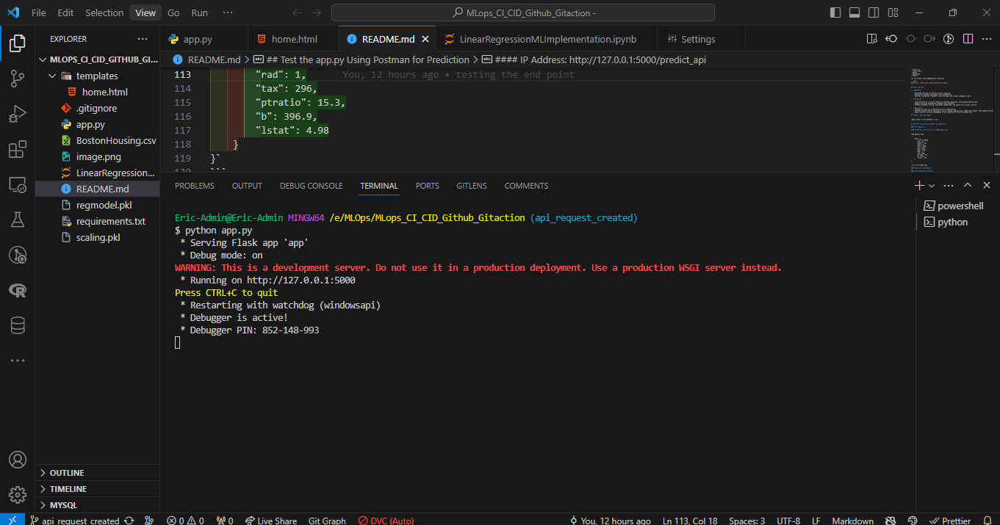
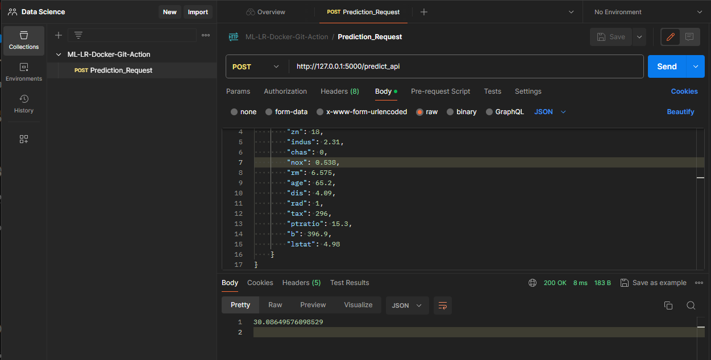
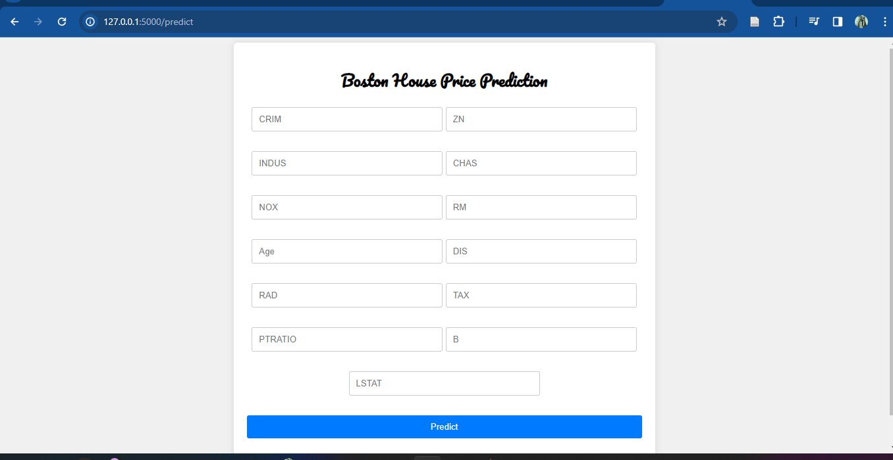

## Boston Housing Dataset Analysis - Machine Learning - Linear Regression - Docker - Github Action

This project aims to analyze the Boston Housing Dataset using machine learning techniques for regression analysis.

## Part I

## Overview

The Boston Housing Dataset is a widely used dataset in machine learning for regression analysis. It contains information collected by the U.S Census Service concerning housing in the area of Boston, Massachusetts. The dataset includes various features such as per capita crime rate, average number of rooms per dwelling, and median value of owner-occupied homes. The target variable is the median value of owner-occupied homes in $1000's.

## Data Loading and Preprocessing

1. The dataset is loaded using pandas' `read_csv()` function from a CSV file named `BostonHousing.csv`.
2. Data preprocessing steps include handling missing values (if any), scaling the features using `StandardScaler`, and splitting the dataset into training and testing sets.

## Analysis and Modeling

1. Exploratory Data Analysis (EDA) is performed to understand the distribution and relationships between features.
2. Linear Regression is chosen as the modeling technique due to its simplicity and interpretability.
3. The Linear Regression model is trained on the training dataset and evaluated using Mean Absolute Error (MAE), Mean Squared Error (MSE), and Root Mean Squared Error (RMSE).

## Usage

1. Clone this repository to your local machine.
2. Install the required dependencies using `pip`.
3. Run the Jupyter Notebook or Python script to analyze the dataset and train the regression model.

## Files Included

- `BostonHousing.csv`: CSV file containing the Boston Housing Dataset.
- `analysis.ipynb`: Jupyter Notebook containing the analysis code.
- `requirements.txt`: Text file listing the required dependencies.

## Results

The trained Linear Regression model achieves the following performance metrics on the test set:

- Mean Absolute Error (MAE): X
- Mean Squared Error (MSE): Y
- Root Mean Squared Error (RMSE): Z

## Conclusion

The analysis of the Boston Housing Dataset provides insights into the factors affecting housing prices in the area. The trained Linear Regression model can be used to make predictions on new data and gain further understanding of the housing market.

## References

- [UCI Machine Learning Repository: Boston Housing Dataset](https://archive.ics.uci.edu/ml/machine-learning-databases/housing/)
- [scikit-learn Documentation](https://scikit-learn.org/stable/documentation.html)

## Part II Create API

## Requirements

To run the code in this project, you need the following dependencies:

- Python 3.x
- scikit-learn
- pandas
- matplotlib
- seaborn

You can install these dependencies using pip:

```bash
pip install scikit-learn pandas matplotlib seaborn
```

## Tools Overview

1. **GitHub:**

   - Web-based platform for version control using Git.
   - Hosting for software development and collaboration.
   - Features include pull requests, issue tracking, and project management tools.

2. **Heroku:**

   - Cloud platform as a service (PaaS) for building, deploying, and managing applications.
   - Supports multiple programming languages and frameworks.
   - Provides automatic scaling, continuous integration, and add-ons for various services.

3. **Git CLI:**
   - Command-line tool for interacting with Git repositories.
   - Performs version control operations such as cloning, adding files, committing changes, and managing branches.
   - Widely used for efficient management of Git repositories from the command line.

## Create a new environment

```
conda create -n venv python=3.7 -ycon
```

## Test the app.py Using Postman for Prediction

#### API Endpoint:

#### IP Address: http://127.0.0.1:5000/predict_api

```
JSON Request Body:

`{
    "data": {
        "crim": 0.00632,
        "zn": 18,
        "indus": 2.31,
        "chas": 0,
        "nox": 0.538,
        "rm": 6.575,
        "age": 65.2,
        "dis": 4.09,
        "rad": 1,
        "tax": 296,
        "ptratio": 15.3,
        "b": 396.9,
        "lstat": 4.98
    }
}`
```

`Running my app.py inside vs code`

`Running the model in Postman application`


#### Additional Information:

#### This repository contains:

`app.py: `The main Flask application script.
`template:` Folder containing the `HTML` template for the home page.

## Part III Create route for prediction, html for end users.

1. Predict Route: rendering the value predicted to the brownser, after receiving variables entered by user.
2. Work on html for better visualization and creating fields for my variables.



## Part III Deployment to the cloud

1. Use heroku platform
2. steps: Create a procfile -- indicate that we are communicating to heroku

A Procfile is a configuration file used by `Heroku or render`, a `platform-as-a-service (PaaS)` provider, to specify the commands that are executed by the app's `dynos` (containers) on the platform.

`web: gunicorn app:app
`
This command tells Gunicorn to start the application defined in the `app.py` file (which contains the Flask app instance named app). Gunicorn will then serve the Flask application.
Here, `web` is the process type and `gunicorn app:app` is the command to start the Gunicorn server for the Flask application.

Deployed version to Render: [Boston House Prediction](https://bostonhouseprediction-hyo3.onrender.com/)
